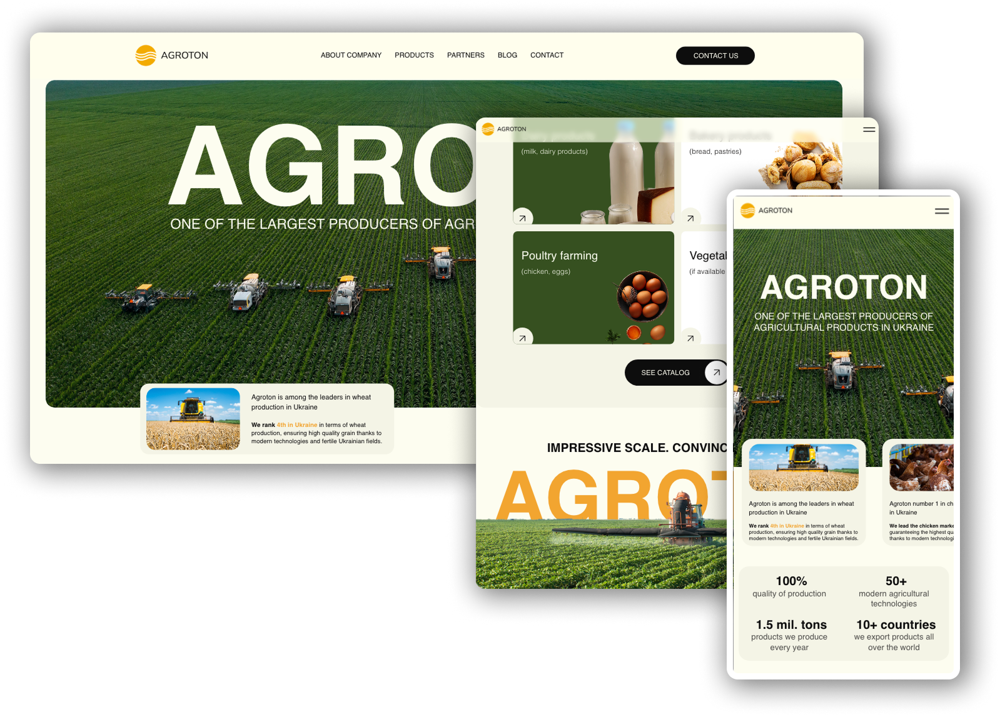

# 🌾 AGROTON Landing Page

**AGROTON** is one of the largest producers of agricultural products in Ukraine.  

This project is a modern and responsive landing page developed to represent the company’s services and values online.

---

## 📸 Preview

🔗 [Live Demo](https://vitakoval.github.io/Agroton/)  

---

## 🔧 Technologies Used

- 🧱 **HTML5** — semantic and clean markup  
- 🎨 **SCSS** — structured styling with variables, mixins, and nesting  
- 📱 **Responsive Design** — optimized for desktop, tablet, and mobile screens  
- ⚙️ **Gulp** — task runner used for building, compiling, and optimizing assets  
- 🧠 **Vanilla JavaScript** — for interactivity and dynamic behavior  

---

## 🚀 Deployment

This project uses **Gulp** together with the [`gulp-gh-pages`](https://www.npmjs.com/package/gulp-gh-pages) plugin to automate deployment to **GitHub Pages**.  
The contents of the `build/` directory are automatically pushed to the `gh-pages` branch, allowing the site to be hosted directly from GitHub.

This setup enables seamless and fast updates without manual publishing steps.  
It’s especially useful for projects with a build process or static site generation.

---

## 👩‍💻 Author

Developed by [Vita Koval](https://www.linkedin.com/in/vita-koval-dev/)

